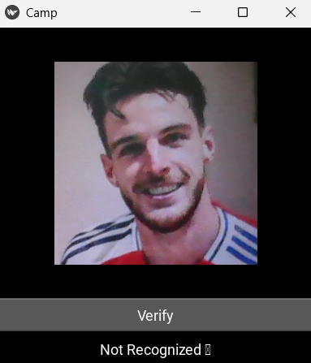

# Deep Facial Recognition 🧠👁️

[](https://www.python.org)
[](https://pytorch.org)
[](https://opensource.org/licenses/MIT)
[](https://opencv.org)
[](https://kivy.org)

A facial verification system using a Siamese Neural Network architecture built with PyTorch. This project enables real-time facial recognition with a webcam to verify if a person matches registered faces in the verification database.

## Application Demo

| Verified (Hi 3llam 🫡) ✅ | Unverified (Not Recognized ❌) |
|:-------------------------:|:-------------------------:|
| | |
|*System recognizes the registered face* | *System doesn't recognize the face* |

## Overview 🔍

This system uses one-shot learning via a Siamese network to perform facial verification without requiring large datasets of the target individual. The model compares an input face against a database of verification images and determines if it's a match based on configurable thresholds.

## Features ✨

- **Siamese Neural Network** 🔄: Utilizes twin networks with shared weights for facial comparison
- **One-Shot Learning** 📸: Requires only a small set of reference images
- **Real-time Verification** ⚡: Process webcam feed for instant facial verification
- **Customizable Thresholds** 🎛️: Adjustable detection and verification thresholds
- **Desktop Application** 🖥️: Built with Kivy for cross-platform GUI interface

## Project Structure 📁

```
Deep-Facial-Recognition/
├── app/                        # Main application folder
│   ├── __init__.py
│   ├── faceid.py               # Kivy application for real-time verification
│   ├── model.py                # Neural network model architecture
│   ├── siamese_network_v2.pth  # Trained model weights
│   └── application_data/       # Application data directory
│       ├── input_image/        # Stores input image from webcam
│       └── verification_images/ # Reference images to compare against
├── application_data/           # Root application data (mirror of app/application_data)
├── data/                       # Training data directory
│   ├── anchor/                 # Anchor images (training)
│   ├── positive/               # Positive images (training)
│   └── negative/               # Negative images (training)
├── models/                     # Stored model weights
├── training_checkpoints/       # Training checkpoint files
└── Facial Verification with a Siamese Network.ipynb  # Training notebook
```

## Technical Details 🔬

### Model Architecture 🏗️

The system implements a Siamese Neural Network with:

- `Embedding network` with CNN layers for feature extraction 🧩
- `L1 Distance layer` to compute similarity between embeddings 📏
- `Classification layer` to determine verification probability 📊

### Training Process 🏋️‍♂️

The model was trained in two distinct phases:

**Phase 1** 📊:

- Training on 300 image samples with no augmentation
- Resulted in initial model (siamese_network.pth)
- Established baseline performance

**Phase 2** 📈:

- Training on 3000 image samples with data augmentation
- Applied transformations including random flips, brightness/contrast adjustments
- Produced the final optimized model (siamese_network_v2.pth)
- Significant improvement in accuracy and generalization

The model was trained using triplets of:

- Anchor images (reference face) ⚓
- Positive images (same person as anchor) ✅
- Negative images (different person) ❌

The model learns to minimize the distance between anchor-positive pairs while maximizing the distance between anchor-negative pairs.

## Installation and Usage 🚀

### Prerequisites 📋

- Python 3.8+ 🐍
- PyTorch 🔥
- OpenCV 👁️
- Kivy (for the desktop GUI application) 🖼️
- PIL (Pillow) 🖼️

### Setup ⚙️

1. Clone the repository:

```bash
git clone https://github.com/yourusername/Deep-Facial-Recognition.git
cd Deep-Facial-Recognition
```

2. Install dependencies:

```bash
pip install -r requirements.txt
```

3. Running the application:

```bash
cd app
python faceid.py
```

### Using the Application 📱

1. Launch the desktop application 🖥️
2. Position your face in the camera frame 😊
3. Click "Verify" button to check if your face matches the verification database 🔍
4. Result will be displayed on screen ✓

## Training Your Own Model 🧠

The complete training process is documented in the Jupyter notebook. To train with your own data:

1. Collect images for the anchor, positive, and negative directories 📸
2. Run the notebook cells to:
   - Preprocess images 🔄
   - Create the dataset 📦
   - Train the Siamese network 🏋️‍♂️
   - Evaluate and save the model 💾

## License 📜

This project is licensed under the MIT License - see the LICENSE file for details.

## Acknowledgments 🙏

- The Labeled Faces in the Wild dataset was used for negative samples during training
- This project implements concepts from the paper [Siamese Neural Networks for One-shot Image Recognition](https://www.cs.cmu.edu/~rsalakhu/papers/oneshot1.pdf) by Gregory Koch, Richard Zemel, and Ruslan Salakhutdinov (2015)
